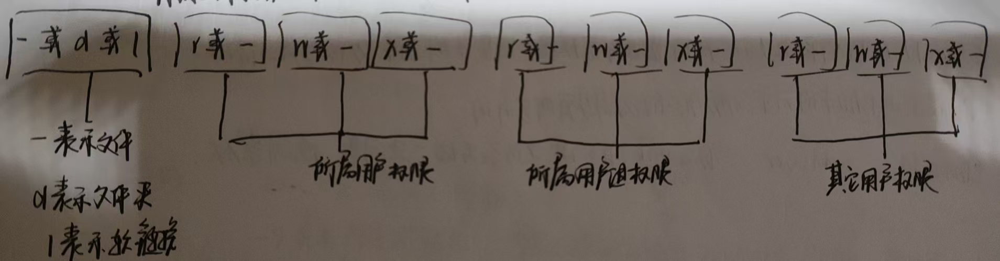

# Linux操作系统

## Linux操作系统基础学习

### 1、硬件和软件

硬件：电脑的物理装置总称。

软件：用户和硬件之间的接口和桥梁。

硬件和软件就是计算机的两个组成部分。

操作系统是软件的一种，它的作用是调度和管理硬件进行工作。

### 2、Linux内核

一个操作系统由两部分组成：·系统内核

​                                                  ·系统级应用程序

内核提供了系统最核心的功能：调度CPU、调度内存、调度文件系统、调度网络通讯、IO等等硬件交互功能。

系统级应用程序则可以理解为电脑出厂自带的程序，可以帮助用户快速上手操作系统。

具体：

​                       ——第三方程序——调用—

用户————                                 |           |

​                       ——系统程序——调用——内核——调度——硬件

Linux操作系统是开源的，因此，我们可以简单的获取Linux操作系统的内核，然后经过修改之后，自行集成系统级应用程序，就可以得到一个新的Linux操作系统发行版。一般学习Linux操作系统，我们主要是学习CentOS和Ubuntu。

### 3、虚拟机介绍

虚拟机：在电脑中，程序员通过一系列虚拟化的软件得到虚拟化的硬件，并且给虚拟硬件安装真实的操作系统，这样就能得到一个虚拟出的完整的电脑，也即是虚拟机。

在我们学习使用Linux操作系统的过程中，我们不可避免的会对操作系统有所改变甚至损坏，因此安装一个虚拟机来学习也就是必要的了。

### 4、虚拟机的环境配置
全自动化安装了VMware之后很容易就能操作。

### 5、远程连接Linux操作系统

在虚拟机中会有提示，或者我们自行找到文件导入即可。

在实际电脑中，我们要远程连接Linux操作系统，首先来看看怎么安装Linux操作系统并且配置相应的环境。

1、安装wsl

首先打开控制面板，点击程序，进入“启动/关闭Windows功能”界面，打开其中的wsl。

打开电脑的命令提示符界面，输入命令：wsl --Install，电脑就会开始下载wsl，下载完成之后，使用命令wsl --version来查看安装情况。安装完成之后，我们点击进入电脑的微软商店，下载一个我们想要使用的发行版，建议是Ubuntu22.04版本。然后进入Ubuntu，等待一段时间之后，输入用户名和密码，就可以开始使用Linux了。

2、远程连接

下载一个VScode，在使用界面，我们点击左侧的远程资源管理器，然后就可以连接对应的发行版了。

3、SSH远程连接

在远程资源管理器中我们可以找到SSH连接，点击之后按照提示输入本机ip和用户名，配置完成之后就能实现ssh连接linux系统了。

## Linux基本命令

### 1、ls命令

命令格式：ls [-a  -l  -h] [Linux文件路径]
1.ls————展示当前工作目录下的信息
   1.ls -a  表示展示隐藏信息
   2.ls -l  表示以竖式展示信息，展示出的信息会更详细
   3.ls -h  表示增加展示文件的大小等等信息
### 2、目录切换命令

cd，只有参数，没有选项，作用就是切换当前工作目录。

pwd，没有选项，没有参数，直接输入，作用是展示当前的工作目录。

### 附加内容：相对/绝对路径
ps：我们来了解一下相对路径和绝对路径

绝对路径是以根目录为起点，以/开头。

相对路径是以当前工作目录为起点，无须以/开头。

.    可以表示当前目录；..    可以表示上一级目录；~    可以表示HOME目录。

### 3、创建目录目录

mkdir  [-p]  Linux路径

作用是在指定目录下创建一个目录，其中-p是用于创建多级目录。

### 4、文件操作命令

touch    作用：创建文件，无选项，有参数-文件名，且文件名是必填的。

cat         作用：查看文件内容，无换页

more     作用：查看文件内容，有换页，在文件内容较多的时候使用。

cp  [-r]  参数1  参数2    作用：用于复制文件或文件夹

​    ·-r    用于复制文件夹时使用

​    ·参数1    Linux路径，表示被复制的文件/文件夹的路径

​    ·参数2    Linux路径，表示要复制去的目的地路径

mv  参数1  参数2

​    ·参数1    Linux路径，表示被复制的文件/文件夹的路径

​    ·参数2    Linux路径，表示要复制去的目的地的路径，如果目的地不存在，那么mv将会把被复制的文件夹改名

rm  [-r  -f]  参数1，2，3，4，5，······

​    ·-r    用于文件夹的删除操作

​    ·-f    表示强制删除，使用之后不会弹出提示确认信息

​    ·参数    表示要删除的文件路径
### 5、查找命令
which    作用：查看所使用的一系列命令的程序文件放在哪里。比如which cd，就会显示cd命令程序文件所在的位置。
find     作用：查找文件。格式如下：
               ·find  起始路径  -name  "需要查找的文件名"
               ·find  起始路径  -size  +/- n k/m/g————这里，size表示文件大小，+/-表示大于/小于，n则表示大小数字，k/m/g是内存大小单位。
### 6、过滤命令
grep     作用：过滤带有关键字的内容并展示，格式如下：
               ·grep  -n  关键字  文件路径————这里，-n表示在结果中显示匹配的行的行号，关键字就是我们需求的关键字，路径则是我们要过滤内容的文件路径
### 7、wc命令
wc       作用：统计文件的一些信息，包括文件的行数、单词数量等等。格式如下：
               ·wc  -c————表示统计文件内容中的bytes（字节）数量
               ·wc  -m————表示统计文件内容中的字符数量
               ·wc  -l————表示统计文件内容的行数
               ·wc  -w————表示统计文件内容中的单词数量
### 附加内容：管道符
ps：学习了前面的这些命令，现在我们来学习一个特殊的符号，管道符：|
管道符的含义是：将管道符左边命令的结果，作为右边命令的输入。举个例子：
       文件learn.txt的内容是： itheima is a brand of itcast
                              itheima stock code is 002032
我们可以在终端中输入命令：
cat learn.txt | grep "itcast"
原本grep命令在关键字之后还要输入一个要实现过滤操作的文件的文件路径，现在我们使用了管道符，cat learn.txt的结果就会直接变成grep命令的对象了。最后的结果是：itheima is a brand of itcast。而且对应的itcast关键字部分还会有特殊的颜色标识。
还有一个要注意的点是：管道符的使用是可以嵌套的！比如上面我们输入的cat learn.txt | grep "itcast"，也可以作为一个其它命令的输入对象，例如我们可以对它使用wc命令来统计其中有几个字符，几个单词等等，注意灵活使用。
### 8、输出命令
echo     作用：在命令行输出指定内容。格式如下：
               ·echo  "输出的内容"
    有关echo输入的内容，我们有一些辅助的符号：
    ·反引号"`"，被反引号包围的内容会作为一串命令去执行，例如我们可以执行：echo 反引号+pwd+反引号，这样就能输出当前工作的目录了。
    ·重定向符：1.>，表示将左侧命令的结果，覆盖写入到符号右侧指定的文件中。
              2.>>，表示将左侧命令的结果，追加写入到符号右侧指定的文件中。
### 9、tail命令
tail    作用：查看文件的尾部内容，追踪文件的最新修改。格式如下：
              ·tail  -f/-num  文件路径
              1.-f表示持续更新文件的修改，启用-f之后，tail命令会一直执行。
              2.-num表示查看尾部的行数，如果不填写-num选项，tail命令会默认查看文件尾部十行的信息。 
### 附加内容：vim编辑器
vi/vim是Linux中最经典的文件编辑器，是命令行下对文本文件进行编辑的最佳选择。
vim是vi的加强版本。兼容vi的所有指令，不仅能够编辑文本，而且还具有shell程序编辑的功能，可以以不同颜色的字体来区分语法的正确性，极大方便了程序的设计和编辑性。

vi/vim的三种工作模式：
    1.命令模式：此模式下，我们敲出的按键都会被理解为命令，以命令驱动不同的功能，但是不能自由的进行文本编辑。
    2.输入模式：此模式下，我们可以对文本进行自由编辑。
    3.底线命令模式：以：开始，通常用于文件的保存、退出。

### 11、su命令和sudo命令
首先我们要了解，Windows、MacOS、Linux这几种典型的操作系统都采用了多用户的管理模式进行权限管理。
在Linux系统中，root（超级管理员）用户拥有最大的系统操作权限。
而对于普通用户，它的权限一般在其HOME目录内是不受限的，一旦处理HOME目录，大多数地方，普通用户只有只读和执行的权限，没有修改的权限。
su命令就是帮助我们切换用户的命令。
·格式：su - 用户名
     ·su - 用户名命令的作用就是切换到对应用户名的账户。如果不加上用户名，直接在一个普通用户下使用su命令，则表示切换到root用户。
     ·-表示是否在切换用户之后加载环境变量，建议带上。
     ·在普通用户的权限下，切换到其它用户需要输入密码，如切换到root，但是使用root切换用户则不需要。
     ·切换用户之后，使用exit命令可以回退到上一个用户，直到回到最初的用户后，再使用exit命令会推出命令提示符界面。
用su命令切换到root账户之后，有了管理员权限，我们可以使用很多原本权限受限的命令，但是注意，长期使用root命令，可能会对系统造成未知的损坏，所以一般我们是不建议长期在root环境下进行工作的。为了解决这个文图，sudo命令诞生了。
·格式：sudo 命令
     ·sudo命令就是为普通命令授权，临时以root的身份执行普通命令。
     ·不是所有用户都可以使用sudo命令，我们需要为普通用户配置sudo认证。
### 12、用户和用户组有关的命令
Linux系统可以： ·配置多个用户                     Linux中关于权限的管控有两个级别：
               ·配置多个用户组                           ·针对用户的权限控制
               ·用户可以加入多个用户组中                  ·针对用户组的权限控制
用户组管理：
     ·创建用户组：groupadd 用户组名
     ·删除用户组：groupdel 用户组名。删除用户组中唯一的用户之后，用户组也会自动删除。
用户管理：
     ·创建用户：adduser 用户名
     ·删除用户：userdel  -r 用户名，-r表示删除用户的HOME目录，不加则会保留。
ps：getent passwd {1000..6000}命令可以查看系统中有哪些用户。
### 13、和权限有关的命令
1.了解权限。
操作系统中，每一个文件/文件夹都有对应的权限，使用ll命令，最前面的10个字母就可以展示出权限细节。

其中，r、w、x分别表示：
    ·r，表示读权限，针对文件，表示可以查看文件内容；针对文件夹，表示可以查看文件夹内容。
    ·w，表示修改权限，针对文件，表示可以修改此文件；针对文件夹，表示可以在文件夹内实现创、删、改操作。
    ·x，表示执行权限，针对文件，表示可以把文件作为程序执行；针对文件夹，表示可以更改工作目录到此文件夹。
2.修改权限控制
     ①chmod命令，格式：chmod  -R  权限  文件/文件夹，作用：修改对应文件/文件夹（-R表示对文件夹中的所有内容都修改权限）的权限为给出的权限参数。
     ②chown命令，格式：chown  -R  用户：用户组  文件/文件夹，作用：修改文件/文件夹所在的用户/用户组。

